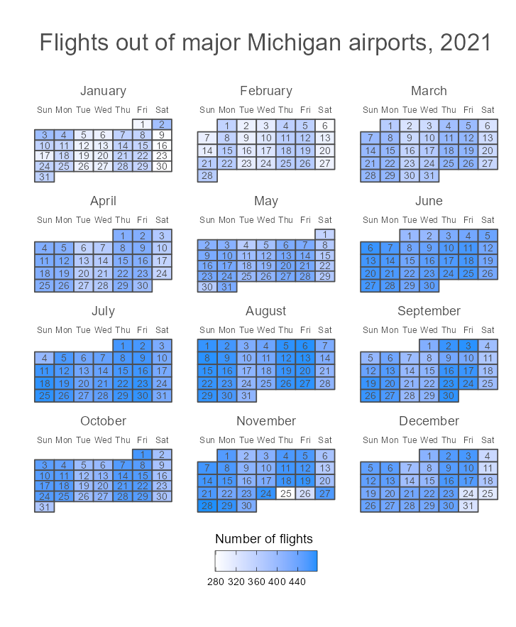

```{r setup, include=FALSE}
knitr::opts_chunk$set(echo = TRUE, warnings = FALSE,error = TRUE)
```

```{r}
library(tidyverse)
library(lubridate)
library(knitr)
library(skimr)
library(calendR)
```

## Example data: Michigan flights

```{r}
michiganFlights <- read_rds("fullMiFlights2021.rds")
```

What type of object is michiganFlights? What is its length?

It is a `list` with 22520240 bytes.

```{r}
# Create tibbles in environment from list
list2env(michiganFlights, envir = .GlobalEnv)
```

```{r}
skim(airlines)

skim(airports)

skim(flights)

skim(planes)

skim(weather)

```

**Suppose we wanted to draw (approximately) the route each plane flies from its origin to its destination. Which variables would we need? Which tables would we need to combine?**

flights(origin,dest) and airports(name,lat,long)


**Now suppose we wanted to explore typical weather patterns for departing flights at different airports and explore the weather’s relationship with departure delays. Considering the wind speeds and amount of precipitation, which variables would we need for this? Which tables would we need to combine?**

weather and flights

## Outer joins

**Combine the flights and airlines data frames with left_join() to create a new data set called flightsCarriers.**

```{r}
flightsCarriers <- flights |>
  left_join(airlines)

```

**Calculate the average flight distance for each carrier using the full name of the carriers. Who had the longest flights on average? Who had the shortest?**

```{r}
flights|>
  left_join(airlines) |>
  group_by(name) |>
  summarise(AVG_DISTANCE = mean(distance)) |>
  arrange(desc(AVG_DISTANCE))
```

**Combine the weather and flights data frames with left_join() to create a new data set called weatherFlights. How many rows does weatherFlights have? Hint: First fix an issue with the time_hour variable using the code below.**

```{r}
# Fixing time_hour variable in weather data set
weather <-  weather |> 
  mutate(time_hour = lubridate::make_datetime(year, month, day, hour))
```

```{r}
weatherFlights <- weather |>
  left_join(flights)
nrow(weatherFlights)
```

**Combine the flights and weather data frames with left_join() to create a new data set called flightsWeather. How many rows does flightsWeather have?**

```{r}

flightsweather <- flights |>
  left_join(weather, by = c("year" = "year",
                            "month" = "month",
                            "day" = "day",
                            "hour" = "hour",
                            "origin" = "origin"))
nrow(flightsweather)
```


**Combine the weather and flights data frames with full_join() to create a new data set called weatherFlightsFull. How many rows does weatherFlightsFull have?**

```{r}
weatherFlightsFull <- weather |>
  full_join(flights)
```

**Considering all of the data we have available, how many flights have missing wind speeds?**

```{r}
flightsweather |> pull(wind_speed) |> is.na() |> sum()

```

## Inner Joins

**Combine the weather and flights data frames with inner_join() to create a new data set called innerWeatherFlights. How many rows does innerWeatherFlights have?**

```{r}
innerWeatherFlights <- inner_join(weather,flights)
nrow(innerWeatherFlights)
nrow(weatherFlights)
```
## Bonus (Optional)

**Create a heatmap calendar with R using the calendR package and the code below.**

```{r}
library(calendR)

# Calculating number of flights for each date
nFlights <- flights |> 
  dplyr::count(year, month, day) |> 
  arrange(year, month, day)

# Creating heatmap calendar of number of flights
flights_calendar <- calendR(year = 2021,
                            title = "Flights out of major Michigan airports, 2021",
        special.days = nFlights$n,
        gradient = TRUE,
        monthnames = month.name,
        months.size = 11,
        weeknames.size = 3.3,
        legend.pos = "bottom",
        legend.title = "Number of flights",
        ncol = 3,
        margin = 1) +
    scale_fill_gradient(low = "white", high = "dodgerblue",
  guide = guide_colorbar(frame.colour = "black", 
                                               ticks.colour = "black",
                         title.position = "top")) +
  theme(legend.title = )

# Saving plot
size_mult <- 22
ggsave(plot = flights_calendar,
       filename = "calendar_plot.png",
       units = "mm",
       dpi = 120,
       width = 7*size_mult,
       height = 8.5*size_mult)


```

